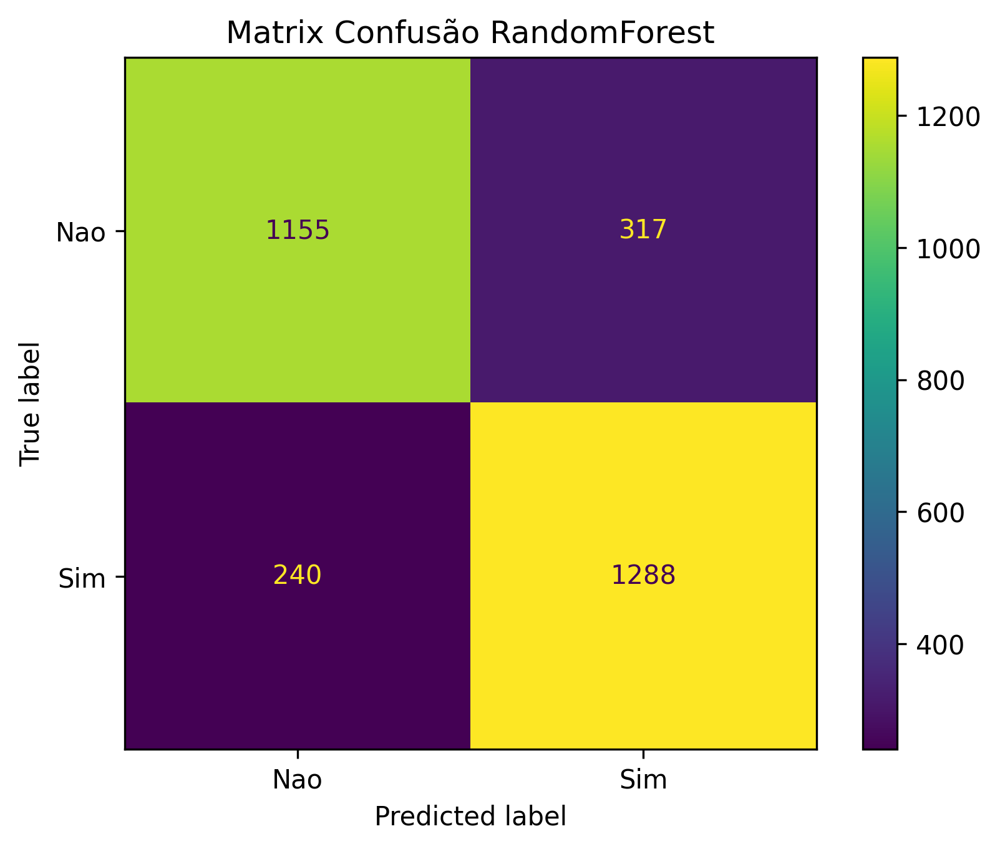

<div align="center">
# 📊 Previsão de Churn de Clientes com PySpark


</div>

---

# 📖 Sobre o Projeto

Este projeto apresenta a construção de um pipeline completo de Machine Learning utilizando **PySpark MLlib** para prever o cancelamento (**Churn**) de clientes.

O fluxo contempla desde o carregamento dos dados até a utilização do modelo treinado para realizar previsões em novos clientes.

O objetivo é demonstrar como desenvolver soluções escaláveis utilizando o Apache Spark para problemas de classificação em grandes volumes de dados.

---

# 🎯 Problema de Negócio

Empresas que trabalham com serviços recorrentes, como telecomunicações, streaming, bancos e planos de saúde, enfrentam constantemente o problema do cancelamento de clientes (**Customer Churn**).

Quando um cliente cancela um serviço, a empresa perde receita e precisa investir recursos para conquistar novos consumidores.

Diante desse cenário, o setor de Marketing solicitou o desenvolvimento de um modelo capaz de identificar antecipadamente quais clientes possuem maior probabilidade de cancelar seus contratos.

Com essas informações é possível:

- Desenvolver campanhas de retenção;
- Criar ofertas personalizadas;
- Reduzir perdas financeiras;
- Melhorar a experiência do cliente;
- Apoiar decisões estratégicas baseadas em dados.

---

# 💡 Por que utilizar PySpark?

Embora este projeto utilize um conjunto de dados de tamanho reduzido para fins didáticos, ele foi desenvolvido utilizando **PySpark**, simulando um ambiente corporativo onde milhões de registros precisam ser processados.

O Apache Spark oferece:

- Processamento distribuído
- Alta escalabilidade
- Paralelismo
- Machine Learning distribuído
- Excelente desempenho em Big Data

Por esse motivo, a liderança técnica definiu a utilização do PySpark para construção do modelo.

---

# 🎯 Objetivos

Construir um pipeline completo de Machine Learning utilizando PySpark capaz de:

- Carregar os dados
- Explorar o dataset
- Preparar os dados
- Construir features
- Treinar modelos
- Avaliar métricas
- Realizar otimização de hiperparâmetros
- Salvar o pipeline
- Salvar o modelo
- Classificar novos clientes

---

# 🛠 Tecnologias Utilizadas

- Python
- PySpark
- Apache Spark MLlib
- Pandas
- NumPy
- Matplotlib
- Scikit-Learn
- Google Colab

---

# 📂 Estrutura do Projeto

```
Classificacao_Churn_PySpark/

│
├── data/
│   └── dados_clientes.csv
│
├── images/
│   ├── matriz_confusao_rf.png
│   ├── feature_importance.png
│   └── pipeline.png
│
├── models/
│   ├── pipeline_preprocess_churn/
│   ├── classificador_rf_final_churn/
│   └── schema_churn.json
│
├── notebook/
│   └── churn_pyspark.ipynb
│
├── README.md
│
└── requirements.txt
```

---

# ⚙️ Pipeline do Projeto

```
CSV

↓

Leitura dos Dados

↓

Análise Exploratória

↓

StringIndexer

↓

OneHotEncoder

↓

VectorAssembler

↓

StandardScaler

↓

Treinamento

↓

Logistic Regression

↓

Random Forest

↓

Cross Validation

↓

Melhor Modelo

↓

Persistência

↓

Predição
```

---

# 📊 Dataset

O conjunto de dados contém informações dos clientes da empresa, incluindo características pessoais e contratuais.

Exemplos de variáveis:

| Variável | Descrição |
|----------|-----------|
| Genero | Sexo do cliente |
| Idoso | Cliente possui mais de 65 anos |
| Parceiro | Possui parceiro |
| Dependentes | Possui dependentes |
| TempoContrato | Tempo como cliente |
| Internet | Tipo de internet |
| SuporteTecnico | Possui suporte técnico |
| StreamingTV | Possui Streaming |
| TipoContrato | Mensal ou anual |
| MetodoPagamento | Forma de pagamento |
| Mensalidade | Valor mensal |
| Churn | Variável alvo |

---

# 🔄 Pré-processamento

Foi criado um Pipeline utilizando PySpark contendo:

- StringIndexer
- OneHotEncoder
- VectorAssembler
- StandardScaler (avaliado)
- Pipeline MLlib

O uso do Pipeline garante que exatamente as mesmas transformações sejam aplicadas durante o treinamento e também durante a inferência.

---

# 🤖 Modelos Treinados

Foram avaliados dois algoritmos:

## Logistic Regression

Modelo linear utilizado como baseline.

---

## Random Forest

Modelo baseado em árvores de decisão que apresentou melhor desempenho após otimização dos hiperparâmetros.

---

# 🔍 Otimização de Hiperparâmetros

Foi utilizado:

- ParamGridBuilder
- CrossValidator

Foram avaliadas diferentes combinações de:

- Número de árvores
- Profundidade máxima
- Número de divisões
- Estratégias de divisão

---

# 📈 Avaliação dos Modelos

As métricas utilizadas foram:

- Accuracy
- Precision
- Recall
- F1-score
- Classification Report
- Matriz de Confusão

## Resultado Final

| Modelo | Accuracy |
|---------|-----------|
| Logistic Regression | ~80% |
| Random Forest | **81.83%** |

---

# 📷 Matriz de Confusão

<p align="center">



</p>

---

# 💾 Persistência do Modelo

Após o treinamento foram salvos:

- Pipeline de Pré-processamento
- Modelo Random Forest
- Schema original dos dados

Isso permite realizar previsões futuras sem necessidade de novo treinamento.

---

# 🔮 Classificando Novos Clientes

## Carregando Pipeline

```python
pipeline_preprocess = PipelineModel.load(
    "pipeline_preprocess_churn"
)
```

## Carregando Modelo

```python
rf_model = RandomForestClassificationModel.load(
    "classificador_rf_final_churn"
)
```

## Transformando os Dados

```python
cliente_processado = pipeline_preprocess.transform(
    novo_cliente_df
)
```

## Predição

```python
predicao = rf_model.transform(cliente_processado)
```

Resultado:

```
Cliente irá cancelar o serviço.

Probabilidade: 87.43%
```

---

# 🚀 Como Executar

## Clone o projeto

```bash
git clone https://github.com/Johnny-DF26/Classificacao_Churn_PySpark.git
```

---

## Entre na pasta

```bash
cd Classificacao_Churn_PySpark
```

---

## Instale o PySpark

```python
!pip install pyspark
```

---

## Abra o Notebook

Execute o notebook utilizando o Google Colab.

---

# 📌 Resultados Obtidos

✔ Pipeline completo em PySpark

✔ Pré-processamento automatizado

✔ Comparação entre modelos

✔ Cross Validation

✔ Persistência do Pipeline

✔ Persistência do Modelo

✔ Predição de novos clientes

✔ Pipeline reutilizável

---

# ⚠️ Limitações

Este projeto possui finalidade educacional.

Algumas melhorias possíveis:

- Utilização de XGBoost
- Balanceamento de classes
- Feature Selection
- SHAP Values
- Deploy em API
- Monitoramento do modelo
- MLflow

---

# 🚀 Trabalhos Futuros

- Deploy utilizando FastAPI
- Docker
- MLflow
- Airflow
- Dashboard em Streamlit
- API REST
- Pipeline automatizado
- Integração com banco de dados

---

# 🤝 Contribuições

Contribuições são muito bem-vindas.

Caso tenha sugestões de melhorias:

- Abra uma Issue
- Faça um Fork
- Envie um Pull Request

---

# 👨‍💻 Autor

**Johnny**

Cientista de Dados em formação.

GitHub:

https://github.com/Johnny-DF26

LinkedIn:

https://linkedin.com/in/datasciencejohnny

---

# 📄 Licença

Este projeto está licenciado sob a licença MIT.

---

## ⭐ Se este projeto foi útil para você, deixe uma estrela no repositório!
